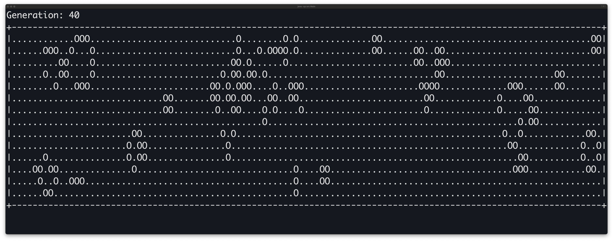

# Conway's Game of Life for UNIX Terminal

A terminal-based implementation of Conway's Game of Life written in Java. This cellular automaton simulation runs directly in your UNIX terminal with automatic size detection and smooth animation.


## About Conway's Game of Life

Conway's Game of Life is a cellular automaton devised by mathematician John Horton Conway in 1970. It consists of a grid of cells that can be either alive or dead, and evolves based on simple rules:

1. **Birth**: A dead cell with exactly 3 live neighbors becomes alive
2. **Survival**: A live cell with 2 or 3 live neighbors stays alive
3. **Death**: All other live cells die (from loneliness or overpopulation)

Despite these simple rules, the Game of Life can produce complex and fascinating patterns.

## Screenshot



*The game running in a terminal, showing Generation 40 with live cells (O) and dead cells (.) creating evolving patterns*

## Project Structure

```
src/
├── Main.java           # Entry point and game initialization
├── GameOfLife.java     # Core game logic and display
└── TerminalUtils.java  # Terminal manipulation utilities
```

## Installation & Usage

### Compile and Run

1. **Clone or download the project**

2. **Navigate to the project directory**
   ```bash
   cd conways-game-of-life-1
   ```

3. **Compile the Java files**
   ```bash
   javac src/*.java
   ```

4. **Run the game**
   ```bash
   java -cp src Main
   ```

## Configuration

You can modify the game parameters in `Main.java`:

```java
GameOfLife game = new GameOfLife(0.2, 500);
//                               ^     ^
//                               |     └── Frame delay in milliseconds
//                               └── Seed probability (0.0 to 1.0)
```

- **Seed Probability**: Controls how densely populated the initial grid is (0.2 = 20% chance each cell starts alive)
- **Frame Delay**: Time between generations in milliseconds (500ms = 2 generations per second)

## Controls

- **Start**: Run the program to begin the simulation
- **Stop**: Press `Ctrl+C` to exit (cursor will be automatically restored)


